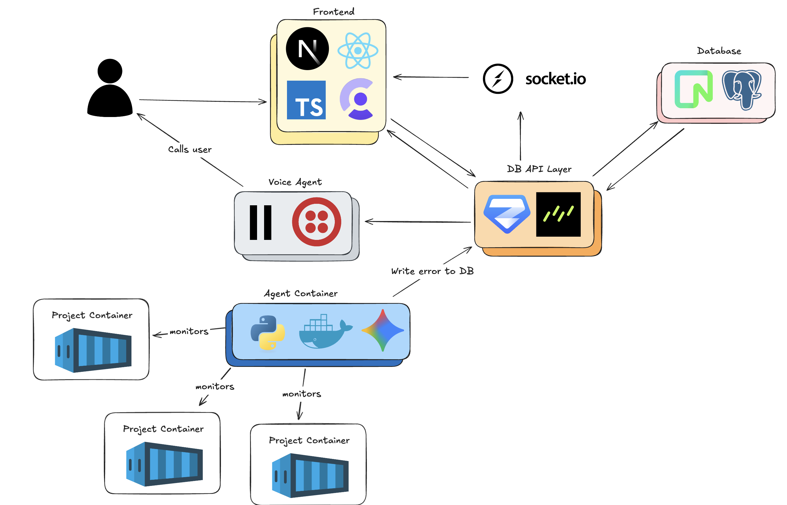
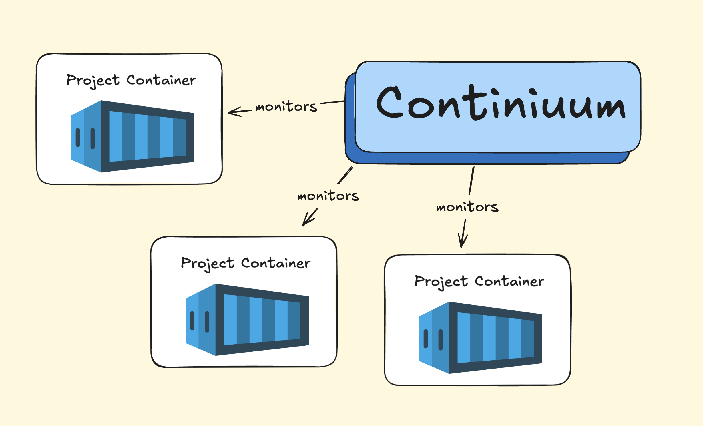
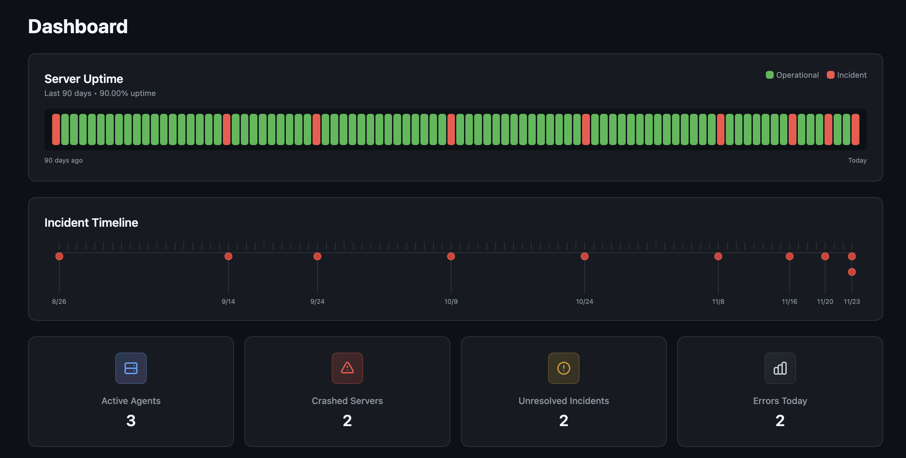
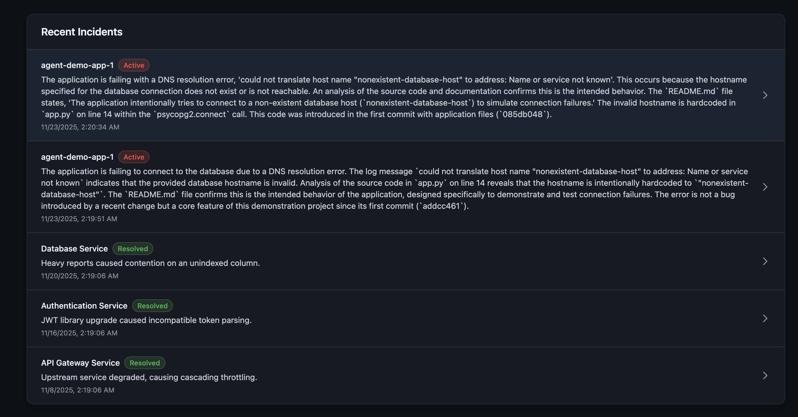

# Continiuum


[https://hw-12-azure.vercel.app/ Backup Link incase domain expires in a year :skull:](https://hw-12-azure.vercel.app/)

## Running the project

[Read this link to install pnpm before running the project](https://pnpm.io/installation)

```bash
pnpm install

pnpm run dev
```

**Additional Scripts for DB related actions:**

```bash
# Open the Drizzle DB editor locally
pnpm run db:studio

# First time generating a DB
pnpm run db:generate
pnpm run db:migrate

# Any subsequent DB schema changes or table rewrites
pnpm run db:push

# Populate DB with mock data
pnpm run db:seed-historical

# Lint related
pnpm run lint
pnpm run lint:fix
```

## Architecture and Tech Stack



## Preview Images







